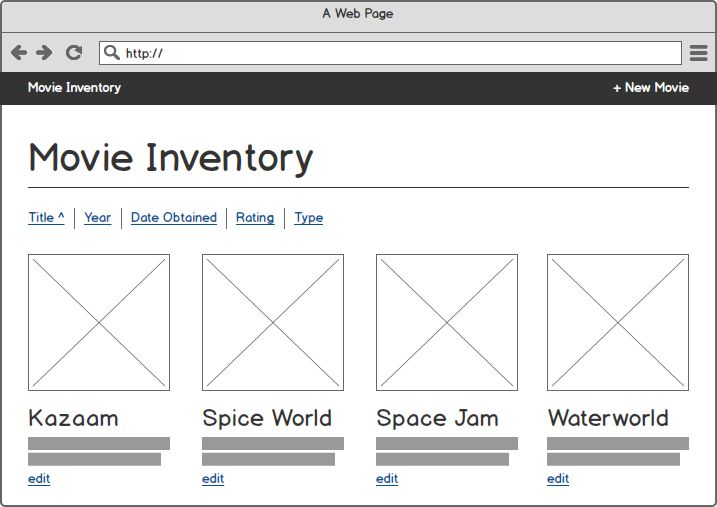
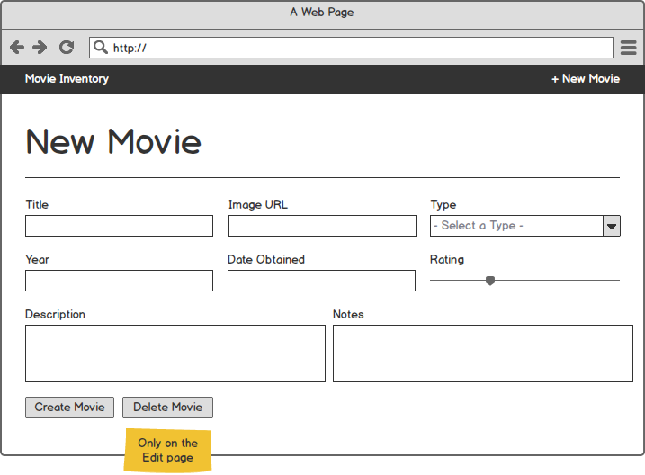

# Movie Inventory CRUD

Create an application that allows you to keep track of your movies!

* Create and delete movies
* Edit existing movies
* Sort movies by various columns

* * *

### Entry Ticket

To complete this project, you will need to understand:

* How to create a simple server via Node and Express
* How to setup a database with multiple, connected tables
* How to connect your server to your database
* How to render HTML with templates

* * *

### Setup

1. Create a Node/Express application. You can roll your own or use the [Galvanize Express Generator](https://github.com/gSchool/generator-galvanize-express).

1. Create a new database called `movie_inventory_crud`.

1. Create a `movies` table with the following columns: 
  > id, title, description, image_url, year, date_obtained, rating, notes, type

* * *

### Routes & Pages

Your web application should create the following routes with the following constraints:

__GET '/'__
* Lists all movies initially by date_obtained (most recent goes first)
* Each movie has basic information about it on the homepage and an edit button
* On the navigation bar is a link to go back to homepage and a link to create a new movie
* Above the movies are a number of links which allow you to sort your movies by a column

__GET '/?[column]=[asc/desc]'__
* Returns the movies sorted by the column name. For example:
  * `/?title=asc` returns all movies ordered by their name in ascending order. 
  * `/?rating=desc` returns all movies ordered by their rating in descending order.
* Renders the homepage with movies ordered as specified.

__GET '/movies/new'__
* Displays a new movie form on the page. The form should include form validation where all inputs are required. Notes are optional.
* Type should be one of the following and is required: Betamax, VHS, DVD, Blueray, Download.

__POST '/movies'__
* Creates a new movie in the database.
* Redirect back to the homepage after correctly creating the movie.

__GET '/movies/:id/edit'__
* Displays a the same form as the new movie page but is pre-populated with data from the specified movie. The form should include form validation where all inputs are required. Notes are optional.
* A button/link at the bottom is included which allows users to delete the specified movie.
* Type should be one of the following and is required: Betamax, VHS, DVD, Blueray, Download.

__POST '/movies/:id/edit'__
* Updates the specified movie in the database.
* Redirect back to the homepage after correctly updating the movie.

__POST '/movies/:id/delete'__
* Deletes the specified movie in the database.
* Redirect back to the homepage after correctly updating the movie.

* * *

### Stretch Goal I

Done? Allow users to "borrow" your movies via API calls!

* Add a column to your `movies` table called `rented` that defaults to `false`.

* Add a column to your `movies` table called `renter`.

* Create a route that accepts a POST called `/api/movies/:id/borrow`. The sender must send along a valid movie ID and, inside the body of the request, a key of 'name'. If the ID is invalid, there is no name, or the movie is already rented, return back to the user a status message with the status code [400](https://http.cat/400). Otherwise, change the `rented` column to `true` and insert the user's name into the `renter` column.

* Create a route that accepts a POST called `/api/movies/:id/return`. The sender must send along a valid movie ID and, inside the body of the request, a key of 'name'. If the ID is invalid, the name provided does not match the name in the database, or the movie is already returned, return back to the user a status message with the status code [400](https://http.cat/400). Otherwise, change the `rented` column to `false` and change the `renter` column to `null`.

* If a movie is borrowed, make sure it is somehow visible on your homepage.

* * *

### Stretch Goal II

_Requires knowledge of [knex](http://knexjs.org/) and/or migrations_

* Create a new table called borrowers with an id, first_name, last_name, and email using a migration

* Create a relationship so that a movie belongs to a borrower (i.e. borrowers have many movies)

* Drop the `rented` column from the movies table

* Add a column called `date_borrowed` to the movies table

* Update the `/api/movies/:id/borrow` route so that a first_name, last_name, and email is required to borrow a movie. If someone attempts to borrow a movie, create a new entry in borrowers for the person ONLY IF they are not already in there.

* When a movie is borrowed, update all the relevant tables; update the movies table with a date the movie was last borrowed.

* When a movie is returned, remove the date from date_borrowed and remove any relationship information between the borrower and the movie